目前主要基于
# Git与GitHub的使用

## 1、Git是什么？能做什么？

* **Git**是一款由Linus大神开发的<font color='red'>版本管理软件</font>，主要用于在项目开发过程中对项目文件版本进行维护。

* **Git**能够帮助开发者在<font color='red'>本地</font>开发过程中对项目文件进行管理，比如开发者在项目功能实现后将相关文件传入Git仓库中，之后又对其中不满意的地方进行了修改，但修改后效果大不如前，此时便可通过Git将文件内容回复到修改前的版本，达到**撤回**的效果。

* 与其他版本管理软件不同，Git的版本信息暂存在用户的本地数据库中，允许用户在离线情况下编辑和暂存文件信息，当用户重新连接网络时，只需要提交即可，这意味着用户回溯文件版本信息的速度非常快，大部分操作都在本地进行。

* Git并不是以changesets的形式来存储信息，而是以**快照**的形式存储，当用户提交一个commit后，Git生成一个**object**，其中包含用户名、邮件地址、提交信息、指向快照的指针、指向父commit的指针等。用户提交一个commit，Git包含以下内容：对应每一个文件的blob，一个包含目录下文件存储信息的tree，一个包含元数据、指向tree的指针的commit object，如图所示。

<details>
    <summary>"A commit and its tree"</summary>
    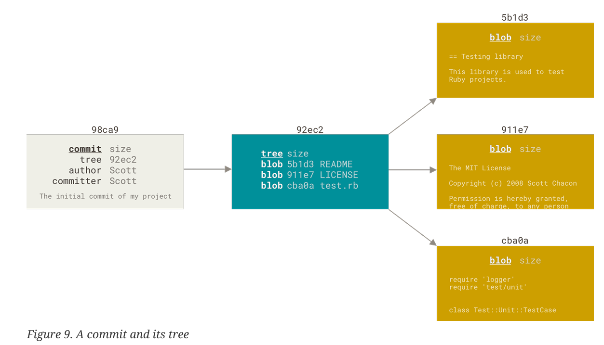
</details>
* 当用户对文件进行修改并重新提交之后，再次生成的commit object会包含指向其父commit object的指针（前一次提交），如图所示。

<details>
    <summary>前后commit关系</summary>
    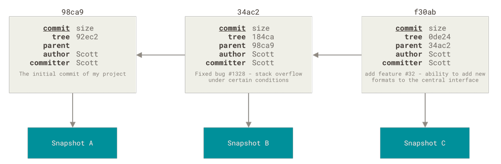
</details>
* Git并不是靠commit的名称来访问对应的信息的，实际上Git是以`SHA-1 hash`（40 个16进制字符）来存储文件的，**branch其实就是所指向commit的`SHA-1 hash`**

* 在Git启动时设置编辑器是必要的，可以避免之后启动时Git识别不到编辑器的问题。

## 2、Git的用法

### 1. 初始化以及建库操作

+ git初始时的一些配置
```shell
# 注意只能一次设定不再修改
git config --global user.name Keith   # 注册git用户名
git config --global user.email luiskeith35@gmail.com    # 注册git邮箱（非正式场合可以乱写）

# 设置编辑器（Linux）
git config --global core.editor vim        # 我使用vim

# 帮助命令
git <command> --help
man git-<command>
git help <command>
git help -h    # 简单呈现可用命令

```

+ 初始建库时的一些操作

```bash
# 1、根据已存在目录初始化一个仓库，创建一个.git隐藏文件夹（此时仓库为空）
git init
git add .          # 将当前文件夹中的文件和非空文件夹设置为准备提交状态（相当于将这些文件放入暂存区）
git commit -m "<描述信息>"   # 将上述在暂存区的文件提交
git log            # 查看提交的历史记录

# 2、克隆一个远端已存在仓库，其中已经有.git文件
git clone <URL>    # 从github已有库下载
git clone <URL> <new_name> 

git checkout HEAD <文件路径>  # 将最后一次的提交信息复制到文件中并覆盖文件中已有的信息
```

*文件工作区$\Longrightarrow$暂存区$\Longrightarrow$本地库$\Longrightarrow$远程库*
### 2. 加入暂存区（staged area）操作

+ 加入暂存区操作
```bash
# track新文件或者已经被track但被修改的文件，文件被提交到stage area
git add <file_name/directory_name>  
```

+ 从工作区中删除文件/目录 或者 停止git跟踪工作区文件/目录 的操作
``` shell
git rm <file_name>     # 删除已经commit的文件同时将文件从当前文件夹删除，“删除操作”处于staged
rm <file_name>         # 效果同上，“删除操作”处于“unstaged”
git rm -f <file_name>  # 强制删除stage area中的文件，“删除操作”处于“staged”

# 最常用
git rm --cached/--staged <file_name>  # 只将其移出stage area，不会删除文件，“删除操作”处于“staged”

git rm log/\*.log      # 删除log/目录下所有.log格式文件
git rm \*~             # 删除文件中以~结尾的文件
```
### 3. 提交操作（到本地库）

commit已经在staged area中的文件或目录：
```shell
git commit        # 提交后的信息页面只显示待提交文件的文件名，进入vim编辑器后在最顶端输入提交信息即可
git commit -v     # 提交后的信息页面显示待提交文件修改的详细信息，操作同上
git commit -m "自定义commit message"    # 不再显示信息页面，直接提交
git commit -a -m "自定义commit message" # 直接跳过stage aera提交unstaged文件（慎用）

# 对已经提交commit的重新修改、stage、commit
git commit --amend         

# 若已经提交且发现有遗漏，可以这么处理
git commit -m 'Initial commit'
git add forgotten_file
git commit --amend
```

### 4. 移动或重命名文件

 更改文件名（当文件已经被commit，“更改文件名操作”也被加入stage area，若文件在stage area，提示为新文件待commit）

```shell
# 更改文件名
git mv file_from file_to  

# 等价于
mv file_from file_to
git rm file_from
git add file_to
```

移动文件到其他目录：

```bash
git mv <file_name> <directory>
```
### 5. 查看commit提交日志信息：

```shell
git log         # 显示commit的SHA-1，修改人的name、email，修改date，commit message
git log -p -2   # -p:显示详细的diff，-2：显示最新添加到stage area的两个entries
git log --stat  # 统计显示各种操作次数
git log --pretty=oneline           # 信息打印一行
git log --pretty=short/full/fuller # 信息打印少/多
git log --pretty=format:"%h - %an, %ar : %s"   # 定义显示格式

# 限定log输出
git log -<n>               # 显示最新添加的n个commit
git log --since/--until=<n>.weeks/2008-01-15/2 years 1 day 3 minutes ago  # 只显示这一时间点后/内提交的commit
git log --author=<author name>                   # 根据作者检索（可多个出现）
git log --grep=<keywords in commit messages>     # 根据关键字检索（可多次出现）
git log --grep=first --grep=changed --all-match  # 二者同时出现，相当于AND
git log -S <string_name>   # 获取一个字符串，并只显示改变了该字符串出现次数的提交
git log -- path/to/file    # 看路径下满足条件的commit
```

<details>
     <summary>git log format格式内容和git log其他命令</summary>
    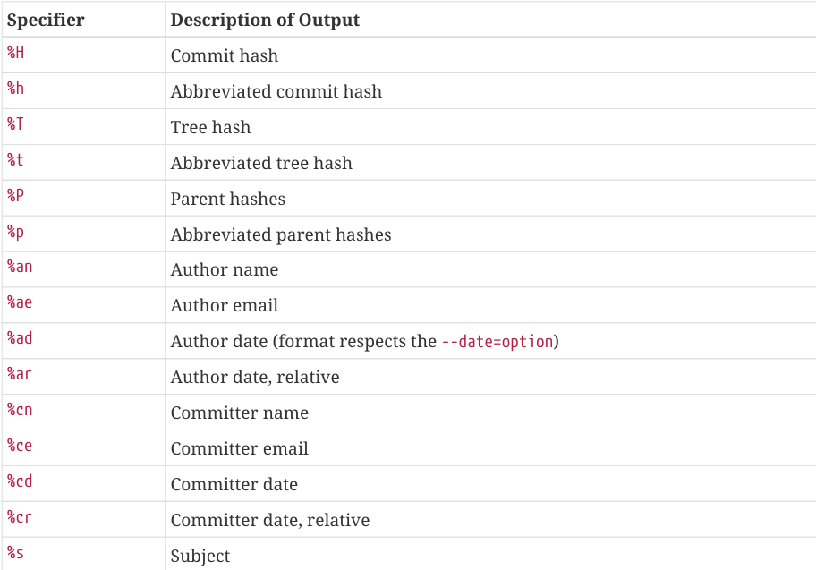 
    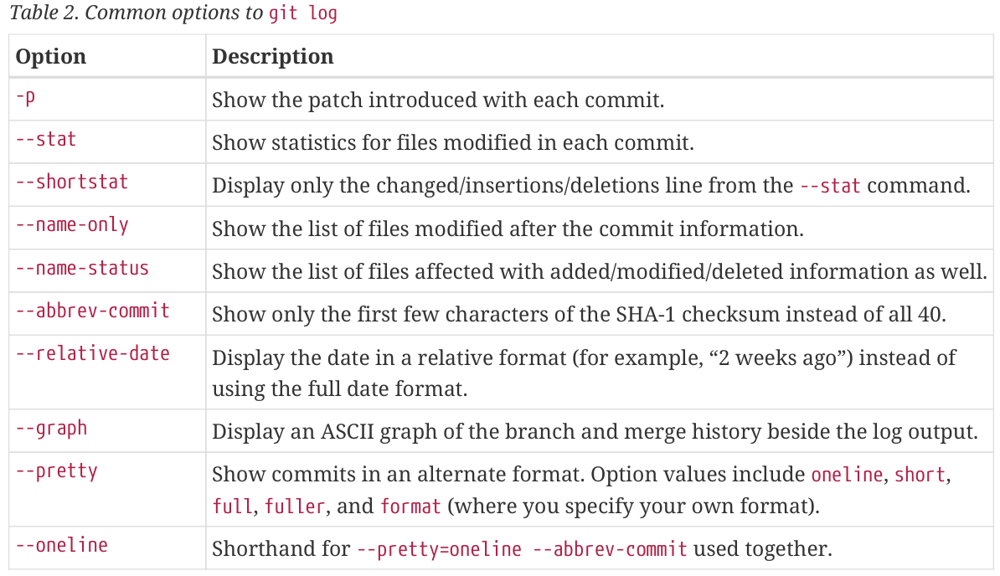
    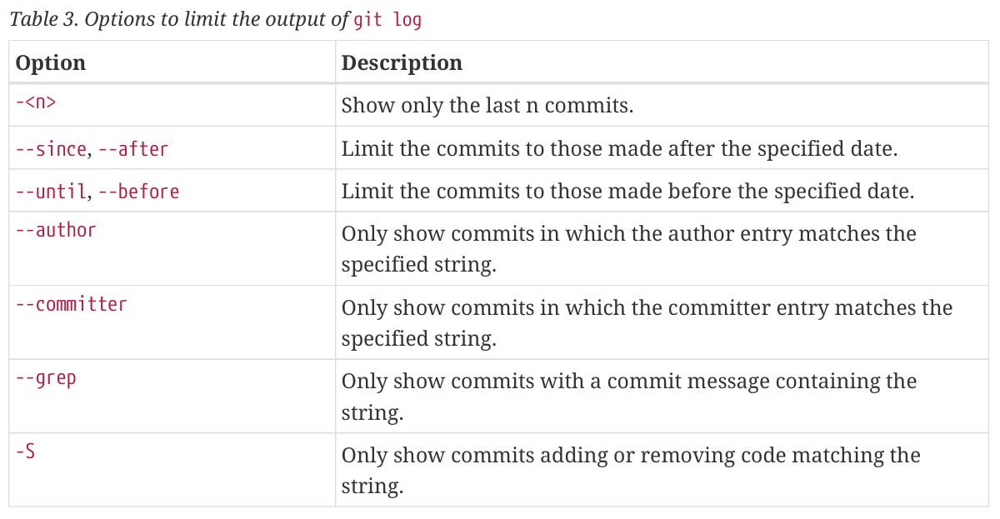
</details>

### 6. 为commit打标签

```shell
git tag (-l/--list)
git tag -l/--list "v1.8.5*"   # 此时-l/--list是mandatory

# tag有annotated tag(是一个对象，包含各种信息)和lightweight tag(指向commit的指针)
# 创建annotated tag
git tag -a v1.4 -m "my version 1.4"   # -m 输入具体信息，斗则git启动message编辑界面
git show v1.4                         # 查看tag详情，包含tagger、date、commit等信息

# 创建lightweight tag
git tag v1.4-lw                      
git show v1.4-lw           # 仅显示commit信息

git tag -a v1.2 9fceb02    # 为某个特定的commit打标签

git describe <refcommitnode> # 基于参考提交节点（默认是HEAD）输出离该节点最近的有标签的节点
<tag content>-<numofcommits>-g<ref hash> # 输出格式

# git push默认不上传tag，需要手动逐个上传，也可以一次性上传
git push <本地自定义remote sever name> <tagname> 
git push <本地自定义remote sever name> --tags
git push <本地自定义remote sever name> --follow-tags  # 仅上传annotated tag

git tag -d <tagname>                    # 删除本地tag
git push <remote> --delete <tagname>    # 删除server tag
git push <remote> :refs/tags/<tagname>  # 删除server tag

# 查看标签指向的文件版本
git checkout <tagname>                   
# 此时本地仓库进入“detached HEAD”状态，若新建一个commit，tag不会变，但该commit不属于任何branch
git checkout -b <branch_name> <tagname>  # 接上，新建了一个branch包含新建的commit
```

### 7. 撤销操作

<font color='red'>注意：撤销命令都需要谨慎使用！</font>

+ 将文件从暂存区撤销到工作区
```bash
# 撤销单个文件
git reset HEAD <file_name>      # staged  ->  unstaged

# 撤销所有 add 的文件 
git reset HEAD .

# git 新版本指令
git restore --staged <file_name>
```

+ 将文件从本地库撤销到暂存区
```bash
# 撤回 commit，代码保留暂存区（推荐）
git reset --soft HEAD^
# 撤回 commit，且删除所有代码修改（危险）
git reset --hard HEAD^

# 撤销最近 2 次 commit（安全保留代码） 
git reset --soft HEAD~2 
# 撤销最近 2 次 commit（删除代码） 
git reset --hard HEAD~2
```

+ 撤销工作区文件的修改（未进入staged area，未进入commit）
```bash
git checkout -- <file>
git restore <file>
```

+ 安全的撤销commit
```bash
git revert <commit hash>或HEAD   # 不会删掉之前的提交，而是新增一个「反向提交」，把那次提交的代码自动抵消掉

git push  # 撤销后推送到远端仓库
```
### 8. 查看仓库当前状态

工作目录下文件有两种状态：**tracked**或者**untracked**，tacked意味着已经有了最新的snapshot，此时文件被Git识别到，文件可以是modified、unmodified、staged，所有clone的文件都是tracked和unmodified。untracked反之。

```shell
# 查看当前状态
git status
git status -s        
git status --short 
# 简短显示：M表示modified but not staged，MM表示modified and staged but modified again but not staged                   A表示new file staged，M再次出现表示modified and staged ??表示untracked

# track新文件或者已经被track但被修改的文件，文件被提交到stage area
git add <file_name/directory_name>  
```

### 9. 使用Git查看具体修改了哪些内容

```shell
git diff              # 仅可查看上次commit之后修改的并且还是unstaged的文件的具体修改内容
git diff --staged/--cached    # 查看已经staged的和上一个commit的文件对比的修改内容

git difftool                  # 图形化（vim等）查看已修改内容
```

### 10. Git分支

branch是一个可移动的指向commit的轻量化指针，默认branch是master/main，其始终指向最后一次提交的commit，如下图所示。head是一个指向当前所在branch的指针，新建一个branch不会将head切换到新branch。

+ 创建分支
```bash
# 新建一个branch
git branch <branch name> <HEAD~^>     
# 不加<HEAD~^>指向当前所在commit的指针，加<HEAD~^>表示指向指定commit节点的分支指针，其中^符号和~符号可以任意组合

# 新建branch同时将HEAD切换到该branch
git checkout -b <newbranchname>
```
<details>
	    <summary>此时只有master一个branch</summary>
	    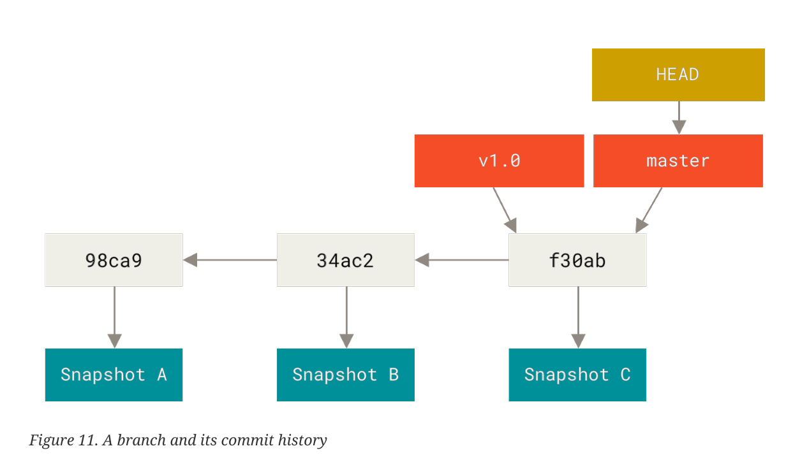
</details>

+ 切换分支
```bash
# Git version2.23后的命令
git switch (-c/--create) <new-branch>    # 新建并切换到该branch
git switch -                          # 切换到上一次离开的branch
```

+ HEAD指针脱离分支指针
```bash
# 查看指针指向的位置
git log --oneline --decorate

# HEAD切换到testing指针
git checkout testing

# 提交一个新的commit，此时HEAD->testing->新commit，main->原commit
vim test.rb
git add test.rb
git commit  -m 'Make a change'

# 查看branch的日志信息
git log <branch_name>   # 查看该branch的commit日志
git log --all           # 查看所有branch的commit日志

# 重新切换HEAD指向
git checkout main/master  # 此时，HEAD->main/master,本地文件也回溯到main/master指向的commit快照状态，由此建立分支

# 再提交一个新的commit
vim test.rb
git add test.rb
git commit  -m 'Make changes'

# 图形化显示分支情况
git log --oneline --decorate --graph --all
```
此时结构图如下所示，出现分支，可以通过切换HEAD指向来切换版本信息。

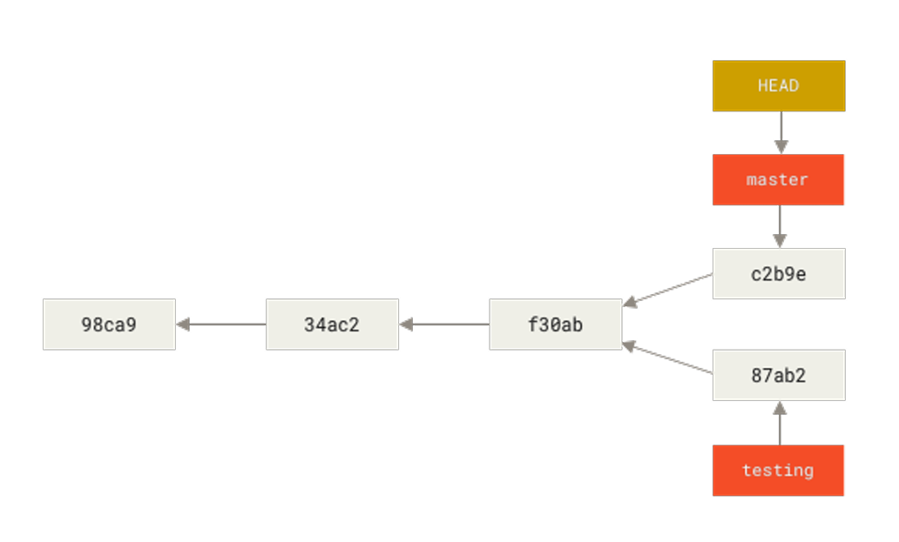
+ 融合分支：将两个branch融合到一起,main/master branch继续指向最新的快照，删除testing branch。融合过程中，Git根据main branch指向的snapshot和testing branch指向的快照，重新生成一个snapshot，再将main branch指向该快照

```shell
# merge 融合会保留原分支的历史
git switch main            # 切换是必要的
git merge testing          # 融合
git branch -d testing      # 删除

# merge conflicts 如果两个branch对应的修改是同一个文件的同一部分内容，就会有冲突，无法merge
git status                 # 查看是哪个文件有冲突，此时冲突文件会被列出，冲突内容将被添加到该文件中，对文件手动修改
git add <file_name>        # 此时文件冲突已经修改，标记为解决方案
git commit                 # 总结merge并提交，此时冲突解决

git mergetool              # 图形化上述问题解决方法

# rebase 重写历史，让提交记录变成一条干净的直线
git switch bugFix
git rebase main   # 将bugFix分支串到main分支后

git rebase <branch_原base(默认HEAD)> <branch_新base> 
```

* Git branch的管理：一般master指向已经稳定可发行的版本，develop指向测试中的版本，topic指向开发中的版本。所以说开发时要早建分支。

```shell
git branch                  # 列出现有的branch，带*的是现在HEAD指向的branch
git branch -v               # 每个branch上的最后一个commit

git branch --delete <branch_name> 

git branch --merged         # 查看与当前所在branch融合的branch
git branch --no-merged      # 查看与当前所在branch未融合的branch
git branch --merged <arg>         # 查看与arg branch融合的branch
git branch --no-merged <arg>      # 查看与arg branch未融合的branch

git branch --move bad-branch-name corrected-branch-name  # 修改本地的branch名称 
git push --set-upstream origin corrected-branch-name     # 修改remote的branch名称
git push origin --delete bad-branch-name                 # 删除remote的已经被修改的branch

# main/master的名字尽量别改，不然会需要更改很多内容，非常麻烦！！

# 指针在branch上的移动
git checkout HEAD^^    # HEAD指针分离并向上移动两个单位（^符号个数表示向上移动次数）
git checkout HEAD~4    # HEAD指针分离并向上移动四个单位（4表示向上移动次数）
git branch -f main HEAD~3  # 将main指针强制向上移动三个单位

# 基于已有的commit构建新的分支
git rebase -i HAED~4  # 将当前指针向上四个单位内的所有commit进行重新筛选、修改、排序等操作，结果生成一个新的分支
git cherry-pick <commit> <commit>... # 排除当前指针指向节点及其所有的父节点后挑选节点，按顺序组成新的分支（该节点的子节点可以被选中）
```

<details>
    <summary>branch工作流</summary>
    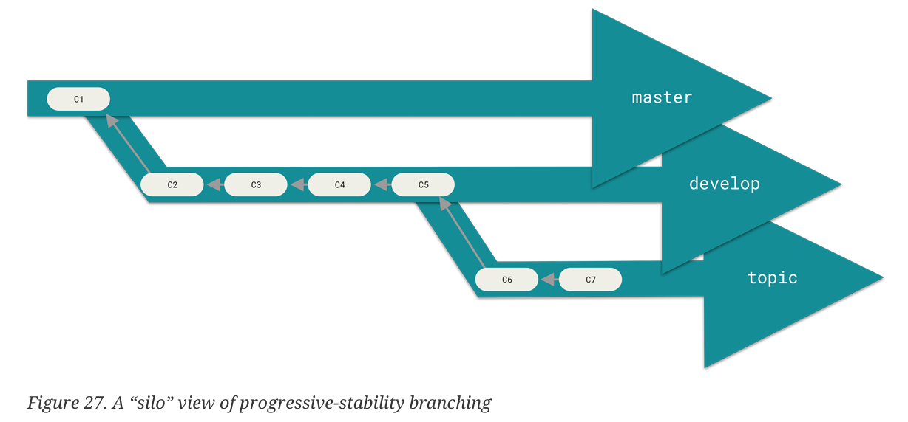
</details>

### 11. 与远端仓库交互：

```shell
git clone <url>     # 远端仓库地址
git remote          # origin是默认的server，此时只显示sever名字
git remote -v       # 显示详细的sever网址

--------------------------------------------------------------------
keith@keith-virtual-machine:~/-Leetcode-$ git remote -v
origin	https://github.com/Leith-kk/-Leetcode-.git (fetch)
origin	https://github.com/Leith-kk/-Leetcode-.git (push)

# 添加远程仓库repo
git remote add <自定义shortname（默认是origin）> <url>   # 添加一个新的可访问仓库

# 获取远端仓库内容的两种方式
# 获取该远端库有但本地库没有的文件，只会更新本地库中远程分支的指向，不会更新本地库本地分支的指向，因此需要手动将其merge in自己的仓库中
git fetch <自定义shortname（默认是origin）> 
# 获取远端库有但本地库没有的内容并将其merge到本地仓库 
git pull <自定义shortname（默认是origin> 
# 加参数的pull
git pull <自定义shortname（默认是origin> <远端仓库任意提交/分支>:<本地后续提交/分支/新分支名>
exp: git pull origin <commit 2>: <new_branch>

git config --global pull.rebase "false" # 不能pull
git config --global pull.rebase "true"  # 可以pull（执行pull之前会查询）

# 推送本地仓库到远端仓库，同时更新本地和远端的所有分支的指向
git push <remote> <branch>  # 将本地branch push到remote server
# 注意如果是有人与你同时clone该仓库并且比你先push，你必须先fetch他push的内容然后再push自己要提交的内容
# 极度灵活的推送管理
git push <remote> <local_branch_sorce>:<remote_branch_destination(若分支不存在可以自己创建)>
exp：git push origin main:test
# 小妙招
git push origin :foo  # 删除远端仓库的foo分支
git fetch origin :bar # 在本地新建bar分支


# 获取远端仓库及其在本地的信息
git remote show <自定义shortname>    
# clone下来的默认branch是main

# 重命名远端仓库名，默认是origin
git remote rename name_from name_to 

# 删除某个remote repository
git remote remove/rm <自定义shortname>
```

* remote branch：git clone的remote库，origin/master和master指向本地库中的同一个commit，origin/master用于指示上次本地库与远端库同步时远端库中的最新提交状态，而master用于跟踪本地开发时本地库的提交状态。此时如果继续添加commit，origin/master指向的commit不变，master指向的commit会不断移动。
* 若remote repository被改动，此时需要使用`git fetch`或`git pull rebase`，具体如下所示：
```bash
# 方法一
git fetch
git merge <another_branch>
git push origin

# 方法二
git pull --rebase
git push origin
```

<details>
    <summary>fetch 但没有merge</summary>
    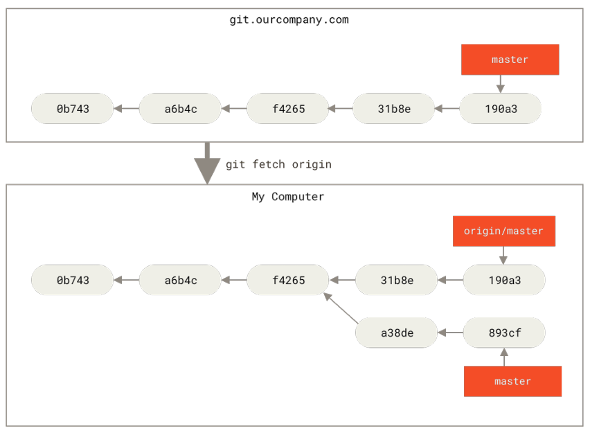
</details>

+ 显示remote的branches等信息
```shell
git ls-remote <remote>
gitremote show <remote>

# 继续添加一个remote repository
git remote add <remote> <url>
git fetch <remote>
# 此时有一个新的 <remote>/origin 指向其从原端库中克隆到本地的最后一个commit
```

+ 切换本地跟踪远程仓库分支的语句
```bash
# 方法一：前提是foo还没有创建
git checkout -b foo o/main

# 方法二：foo若已经创建并且HEAD指向foo，此参数可以省略
git branch -u o/main foo
```
### 12. `.gitignore`文件
在编程时，有时候会生成一些临时文件、日志文件等，为了使Git不会自动track这些文件，可以编辑一个`.gitignore`文件，仓库根目录下的`.gitignore`文件对所有根目录下的文件或文件夹有效，子目录下的`.gitignore`文件只对当前目录有效。

```shell
 # ignore all .a files
 *.a
 # but do track lib.a, even though you're ignoring .a files above
 !lib.a
 # only ignore the TODO file in the current directory, not subdir/TODO
 /TODO
 # ignore all files in any directory named build
 build/
 # ignore doc/notes.txt, but not doc/server/arch.txt
 doc/*.txt
 # ignore all .pdf files in the doc/ directory and any of its subdirectories
 doc/**/*.pdf
 
######################不属于上部分的内容######################
 man gitignore      # 帮助命令，可查看详细使用说明
```

一些参考样板.gitignore写法：[A collection of useful .gitignore templates](https://github.com/github/gitignore)
### 13. Git命令别名（由自己设定），一般没必要：

```shell
git config --global alias.别名 原命令

git config --global alias.co checkout
git config --global alias.br branch
git config --global alias.ci commit
git config --global alias.st status
```
## 3、GitHub是什么？能做什么？

**GitHub**是一个基于Git的在线网站，可以帮助多位开发者实现**在线协作开发**。

## 4、GitHub的用法

为了保持稳定访问，先得保证自己能使用**VPN**进行科学上网。

```shell
# 个人账户
GitHub注册邮箱：luiskeith35@gmail.com
GitHub登录密码：见edge私人钱包
```

### 如何使用别人的仓库

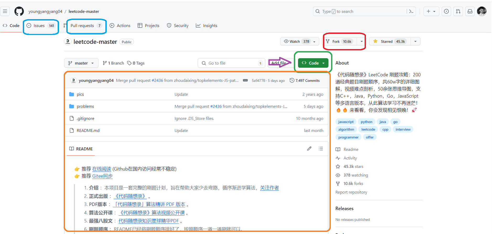

"youngyangyang04"为仓库创建者的用户名，"Leetcode-master"为仓库名

<font color='brown'>Code</font>中包含项目相关的代码文件

<font color='green'>issues</font>相当于为每个项目配备的讨论区，使用者可以在此处与分享者交流

<font color='blue'>Pull requests</font>请求合并自己的代码到原作者仓库，需要提前fork之后，在本地完成后提交到自己的仓库，然后再向原作者提出请求。

<font color='orange'>橙色框中</font>为项目的所有代码文件、许可证（license）文件、说明（README）文件，代码文件为核心部分，说明文件中包含作者对项目的介绍与使用说明，非常有用，使用前必须阅读。

<font color='red'>Fork</font>表示将作者的项目copy到自己的仓库（Repository）中，<font color='red'>Starred</font>表示收藏作者的该项目。在Github中，**star数和fork数越多**，表示大家对该项目的**认可度越高**，因此star数和fork数是GitHub使用中的一个**重要参考数**。

<font color='purple'>紫色箭头</font>指示的<font color='green'>code</font>处可以对代码文件进行**download**，也提供进行**git clone**的链接，并且全过程**免费**，即使不登录也可以下载（吊打:dog:nyd CSDN :angry:）！

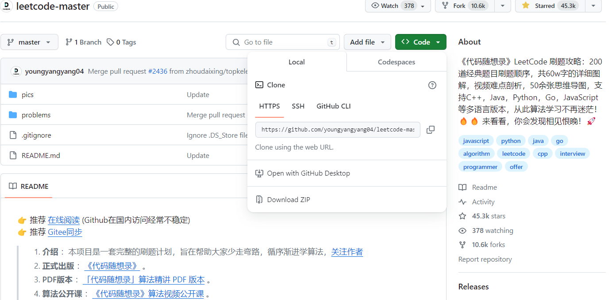

### 如何创建自己仓库

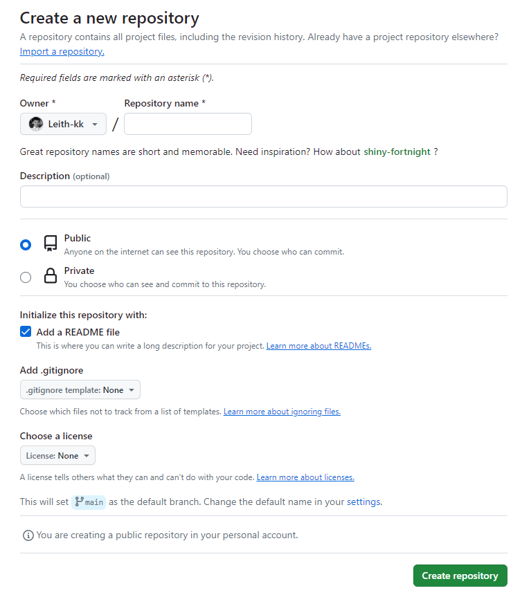

<font color='red'>Repository name</font>为仓库命名，是必填项。
<font color='red'>Description</font>中描述一下该仓库的主要内容，非必填项。
仓库中内容是私密还是公开由自己选择，初始时一般选择**Add a README file**，在其中添加项目功能的具体描述和自己的一些声明。

### 使用GitHub搜索

在GitHub中搜索时，既可以在该仓库搜索，也可以在该作者内容所有内容中搜索，还可以在整个GitHub搜索，相当人性化。

搜索时，可以添加相应的关键词，比如：

**awesome**:搜索相关内容的综合整理

**sample**:搜索相关内容的实例

**tutorials**:搜索相关内容的指导
